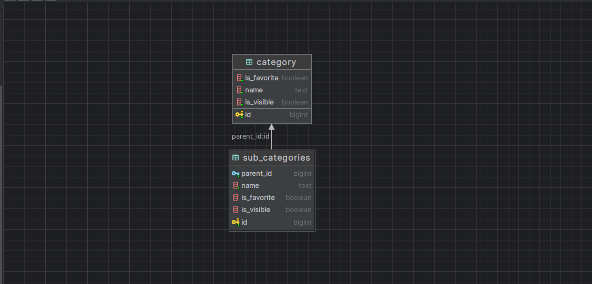

# ms-category

# Table of contents

- [Description](#description)
- [run locally](#run-locally)
- [Tech stack](#tech-stack)
- [Database schema](#database-schema)
- [Swagger link](#swagger-link)

# Description

This is a microservice for category management

# run locally

### please set environment variables before running

***spring.datasource.username=postgres***

***spring.datasource.password=postgres***

```bash
java -jar build/libs/ms-category.jar
```

# Tech stack

- Java 17
- Spring boot
- Postgresql

# Database schema



# Swagger link

[Swagger](http://localhost:8080/swagger-ui/index.html)
